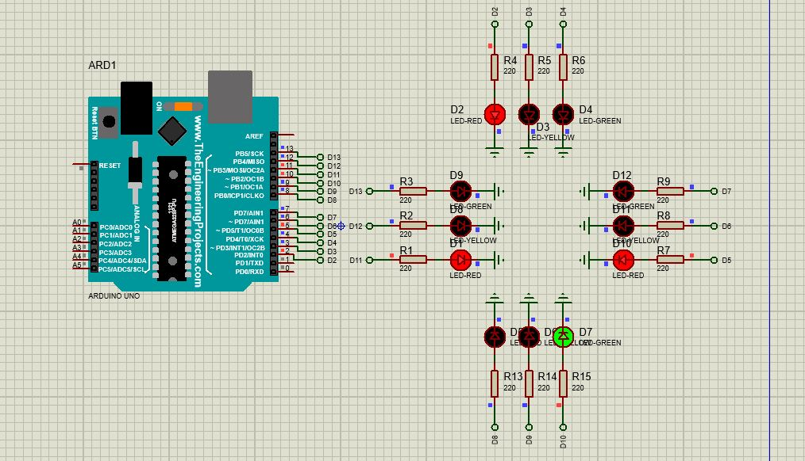

# Traffic Light Control System for a Four-Way Intersection

This project simulates a **traffic light control system** for a four-way intersection using an Arduino Uno. It manages the flow of vehicle traffic with red, yellow, and green lights in a sequential manner.

  

---

## Features
- **Realistic Timing**: Configurable durations for green, yellow, and red lights.
- **Four-Way Traffic Control**: Each lane cycles through the traffic light sequence.
- **Arduino Uno Based**: Simple and efficient microcontroller logic.

---

## Components
1. **Arduino Uno**: Controls the traffic lights.
2. **LEDs**: 
   - 12 LEDs (4 red, 4 yellow, 4 green).
3. **Resistors**: 12 resistors (220Ω each).
4. **Breadboard**: For connecting components.
5. **Jumper Wires**: For circuit connections.

---

## Circuit Diagram
- Connect the anode (long leg) of each LED to its respective Arduino pin via a 220Ω resistor.
- Connect the cathode (short leg) of each LED to GND.

### Pin Assignments
| **Lane**      | **Red Pin** | **Yellow Pin** | **Green Pin** |
|---------------|-------------|----------------|---------------|
| Lane 1 (North-South) | D2          | D3             | D4            |
| Lane 2 (East-West)   | D5          | D6             | D7            |
| Lane 3 (South-North) | D8          | D9             | D10           |
| Lane 4 (West-East)   | D11         | D12            | D13           |

---

## Code
The Arduino code for the traffic light control is located in the `traffic_light_control.ino` file.

### Core Functions
1. **`manageTraffic(int lane)`**: Handles the traffic light sequence for one lane.
2. **`setTrafficLight(int lane, int green, int yellow, int red)`**: Sets the state (on/off) for the red, yellow, and green lights of a specific lane.

---

## How to Run
1. **Assemble the Circuit**:
   - Follow the wiring instructions and use the pin assignments above.
2. **Load the Code**:
   - Open the `traffic_light_control.ino` file in the Arduino IDE.
   - Compile and upload it to the Arduino Uno.
3. **Simulate in Proteus** *(optional)*:
   - Load the `.hex` file into the Arduino component in Proteus and run the simulation.

---

## Project Demo
  

---

## License
This project is licensed under the **MIT License**. Feel free to modify and use it for educational purposes.
